# Margins And Safe Area

13 examples with big coloured squares to understand margins and safe area in UIKit (iOS 11)

1. [`UIView`'s `safeAreaLayoutGuide` + `UIView`'s `layoutMarginsGuide`](#1)
1. [`UIView`'s `layoutMargins`](#2)
1. [`UIView`'s `directionalLayoutMargins`](#3)
1. [`UIView`'s `directionalLayoutMargins` + `autoresizingMask`](#4)
1. [`UIViewController`'s `additionalSafeAreaInsets`](#5)
1. [`UIView`'s `insetsLayoutMarginsFromSafeArea`](#6)
1. [`UIViewController`'s `viewRespectsSystemMinimumLayoutMargins`](#7)
1. [`UIView`'s `preservesSuperviewLayoutMargins`](#8)
1. [`NSLayoutYAxisAnchor`'s `constraintEqualToSystemSpacingBelow(_:multiplier:)` + `NSLayoutYAxisAnchor`'s `constraintEqualToSystemSpacingAfter(_:multiplier:)`](#9)
1. [`UIStackView`'s `isLayoutMarginsRelativeArrangement`](#10)
1. [`UIScrollView`'s `contentInsetAdjustmentBehavior` + `UIScrollView`'s `contentInset` + `UIScrollView`'s `contentLayoutGuide`](#11)
1. [`UICollectionView`'s `contentInsetAdjustmentBehavior`](#12)
1. [`UITableView`'s `insetsContentViewsToSafeArea`](#13)

---

### <a name="1"></a>1. `UIView`'s `safeAreaLayoutGuide` + `UIView`'s `layoutMarginsGuide`
```swift
override func viewDidLoad() {
    let yellowView = UIView()
    yellowView.backgroundColor = .yellow
    view.addSubview(yellowView)
    yellowView.translatesAutoresizingMaskIntoConstraints = false
    view.safeAreaLayoutGuide.topAnchor.constraint(equalTo: yellowView.topAnchor).isActive = true
    view.safeAreaLayoutGuide.leadingAnchor.constraint(equalTo: yellowView.leadingAnchor).isActive = true
    view.safeAreaLayoutGuide.trailingAnchor.constraint(equalTo: yellowView.trailingAnchor).isActive = true
    view.safeAreaLayoutGuide.bottomAnchor.constraint(equalTo: yellowView.bottomAnchor).isActive = true
        
    let cyanView = UIView()
    cyanView.backgroundColor = .cyan
    yellowView.addSubview(cyanView)
    cyanView.translatesAutoresizingMaskIntoConstraints = false
    yellowView.layoutMarginsGuide.topAnchor.constraint(equalTo: cyanView.topAnchor).isActive = true
    yellowView.layoutMarginsGuide.leadingAnchor.constraint(equalTo: cyanView.leadingAnchor).isActive = true
    yellowView.layoutMarginsGuide.trailingAnchor.constraint(equalTo: cyanView.trailingAnchor).isActive = true
    yellowView.layoutMarginsGuide.bottomAnchor.constraint(equalTo: cyanView.bottomAnchor).isActive = true
}
```

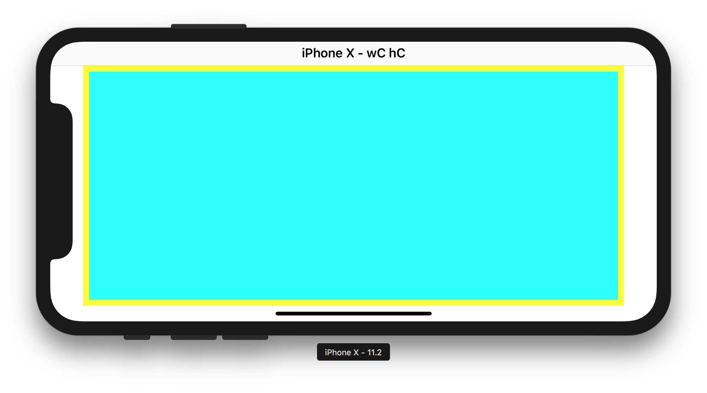

---

### <a name="2"></a>2. `UIView`'s `layoutMargins`
```swift
override func viewDidLoad() {
    let brownView = UIView()
    brownView.layoutMargins = UIEdgeInsets(top: 40, left: 40, bottom: 40, right: 40)
    brownView.backgroundColor = .brown
    view.addSubview(brownView)
    brownView.translatesAutoresizingMaskIntoConstraints = false
    brownView.centerXAnchor.constraint(equalTo: view.centerXAnchor).isActive = true
    brownView.centerYAnchor.constraint(equalTo: view.centerYAnchor).isActive = true
    brownView.widthAnchor.constraint(equalToConstant: 200).isActive = true
    brownView.heightAnchor.constraint(equalToConstant: 200).isActive = true
    
    let blueView = UIView()
    blueView.backgroundColor = .blue
    brownView.addSubview(blueView)
    blueView.translatesAutoresizingMaskIntoConstraints = false
    brownView.layoutMarginsGuide.topAnchor.constraint(equalTo: blueView.topAnchor).isActive = true
    brownView.layoutMarginsGuide.leadingAnchor.constraint(equalTo: blueView.leadingAnchor).isActive = true
    brownView.layoutMarginsGuide.trailingAnchor.constraint(equalTo: blueView.trailingAnchor).isActive = true
    brownView.layoutMarginsGuide.bottomAnchor.constraint(equalTo: blueView.bottomAnchor).isActive = true
}
```

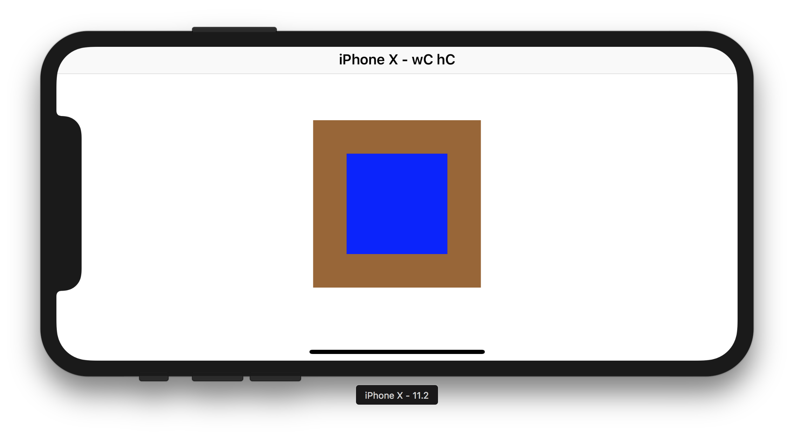

---

### <a name="3"></a>3. `UIView`'s `directionalLayoutMargins`
```swift
override func viewDidLoad() {
    let redView = UIView()
    redView.backgroundColor = .red
    redView.directionalLayoutMargins = NSDirectionalEdgeInsets(top: 70, leading: 70, bottom: 70, trailing: 70)
    view.addSubview(redView)
    redView.translatesAutoresizingMaskIntoConstraints = false
    view.safeAreaLayoutGuide.topAnchor.constraint(equalTo: redView.topAnchor).isActive = true
    view.safeAreaLayoutGuide.leadingAnchor.constraint(equalTo: redView.leadingAnchor).isActive = true
    view.safeAreaLayoutGuide.trailingAnchor.constraint(equalTo: redView.trailingAnchor).isActive = true
    view.safeAreaLayoutGuide.bottomAnchor.constraint(equalTo: redView.bottomAnchor).isActive = true
    
    let greenView = UIView()
    greenView.backgroundColor = .green
    redView.addSubview(greenView)
    greenView.translatesAutoresizingMaskIntoConstraints = false
    redView.layoutMarginsGuide.topAnchor.constraint(equalTo: greenView.topAnchor).isActive = true
    redView.layoutMarginsGuide.leadingAnchor.constraint(equalTo: greenView.leadingAnchor).isActive = true
    redView.layoutMarginsGuide.trailingAnchor.constraint(equalTo: greenView.trailingAnchor).isActive = true
    redView.layoutMarginsGuide.bottomAnchor.constraint(equalTo: greenView.bottomAnchor).isActive = true
}
```

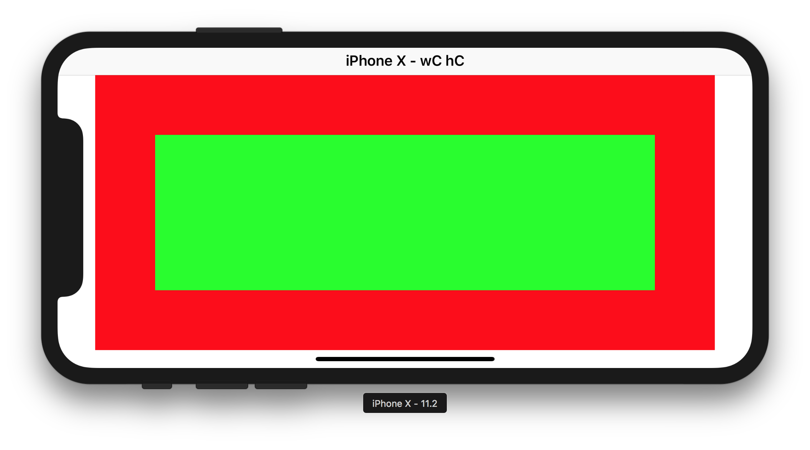

---

### <a name="4"></a>4. `UIView`'s `directionalLayoutMargins` + `autoresizingMask`
```swift
override func viewDidLoad() {
    view.directionalLayoutMargins = NSDirectionalEdgeInsets(top: 100, leading: 100, bottom: 100, trailing: 100)
        
    let orangeView = UIView()
    orangeView.backgroundColor = .orange
    view.addSubview(orangeView)
    orangeView.frame = CGRect(
        x: view.directionalLayoutMargins.leading,
        y: view.directionalLayoutMargins.top,
        width: view.frame.width - view.directionalLayoutMargins.leading - view.directionalLayoutMargins.trailing,
        height: view.frame.height - view.directionalLayoutMargins.top - view.directionalLayoutMargins.bottom
    )
    orangeView.autoresizingMask = [.flexibleWidth, .flexibleHeight]
}
```

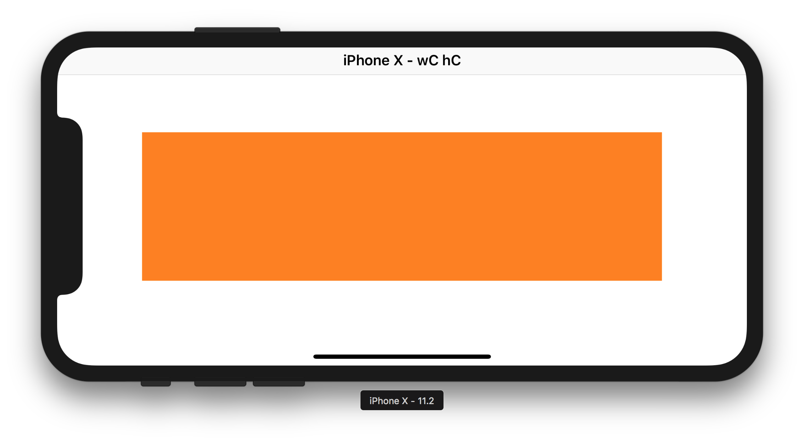

---

### <a name="5"></a>5. `UIViewController`'s `additionalSafeAreaInsets`
```swift
override func viewDidLoad() {
    additionalSafeAreaInsets = UIEdgeInsets(top: 100, left: 100, bottom: 100, right: 100)
        
    let brownView = UIView()
    brownView.backgroundColor = .brown
    view.addSubview(brownView)
    brownView.translatesAutoresizingMaskIntoConstraints = false
    view.safeAreaLayoutGuide.topAnchor.constraint(equalTo: brownView.topAnchor).isActive = true
    view.safeAreaLayoutGuide.leadingAnchor.constraint(equalTo: brownView.leadingAnchor).isActive = true
    view.safeAreaLayoutGuide.trailingAnchor.constraint(equalTo: brownView.trailingAnchor).isActive = true
    view.safeAreaLayoutGuide.bottomAnchor.constraint(equalTo: brownView.bottomAnchor).isActive = true
}
```

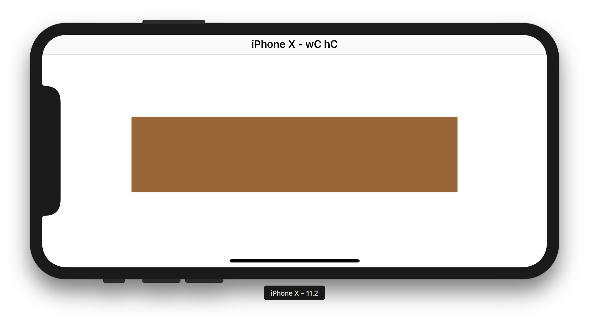

---

### <a name="6"></a>6. `UIView`'s `insetsLayoutMarginsFromSafeArea`
```swift
override func viewDidLoad() {
    view.directionalLayoutMargins = NSDirectionalEdgeInsets(top: 5, leading: 5, bottom: 5, trailing: 5)
    view.insetsLayoutMarginsFromSafeArea = false
        
    let magentaView = UIView()
    magentaView.backgroundColor = .magenta
    view.addSubview(magentaView)
    magentaView.translatesAutoresizingMaskIntoConstraints = false
    view.layoutMarginsGuide.topAnchor.constraint(equalTo: magentaView.topAnchor).isActive = true
    view.layoutMarginsGuide.leadingAnchor.constraint(equalTo: magentaView.leadingAnchor).isActive = true
    view.layoutMarginsGuide.trailingAnchor.constraint(equalTo: magentaView.trailingAnchor).isActive = true
    view.layoutMarginsGuide.bottomAnchor.constraint(equalTo: magentaView.bottomAnchor).isActive = true
}
```

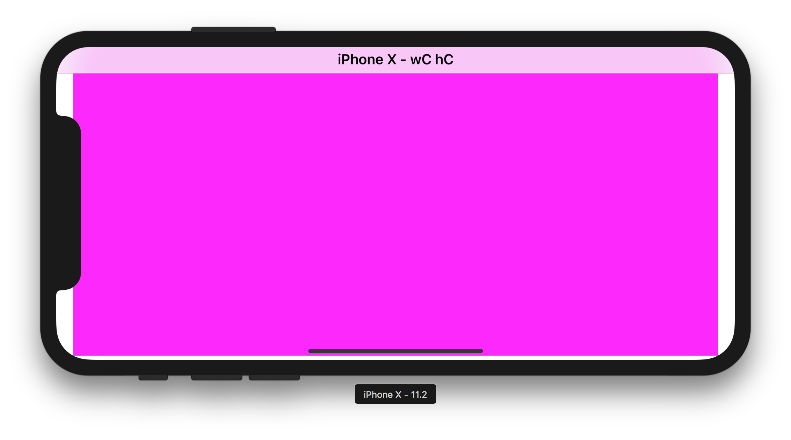

---

### <a name="7"></a>7. `UIViewController`'s `viewRespectsSystemMinimumLayoutMargins`
```swift
override func viewDidLoad() {
    viewRespectsSystemMinimumLayoutMargins = false
    view.insetsLayoutMarginsFromSafeArea = false
    view.layoutMargins = UIEdgeInsets(top: 5, left: 5, bottom: 5, right: 5)
        
    let greenView = UIView()
    greenView.backgroundColor = .green
    view.addSubview(greenView)
    greenView.translatesAutoresizingMaskIntoConstraints = false
    view.layoutMarginsGuide.topAnchor.constraint(equalTo: greenView.topAnchor).isActive = true
    view.layoutMarginsGuide.leadingAnchor.constraint(equalTo: greenView.leadingAnchor).isActive = true
    view.layoutMarginsGuide.trailingAnchor.constraint(equalTo: greenView.trailingAnchor).isActive = true
    view.layoutMarginsGuide.bottomAnchor.constraint(equalTo: greenView.bottomAnchor).isActive = true
}
````

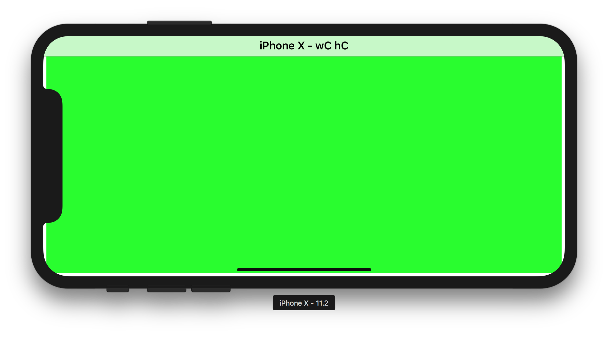

---

### <a name="8"></a>8. `UIView`'s `preservesSuperviewLayoutMargins`
```swift
override func viewDidLoad() {
    viewRespectsSystemMinimumLayoutMargins = false
    view.insetsLayoutMarginsFromSafeArea = false
    view.layoutMargins = UIEdgeInsets(top: 140, left: 140, bottom: 140, right: 140)

    let orangeView = UIView()
    orangeView.preservesSuperviewLayoutMargins = true
    orangeView.backgroundColor = .orange
    view.addSubview(orangeView)
    orangeView.translatesAutoresizingMaskIntoConstraints = false
    view.topAnchor.constraint(equalTo: orangeView.topAnchor).isActive = true
    view.leadingAnchor.constraint(equalTo: orangeView.leadingAnchor).isActive = true
    view.trailingAnchor.constraint(equalTo: orangeView.trailingAnchor).isActive = true
    view.bottomAnchor.constraint(equalTo: orangeView.bottomAnchor).isActive = true
    
    let yellowView = UIView()
    yellowView.backgroundColor = .yellow
    orangeView.addSubview(yellowView)
    yellowView.translatesAutoresizingMaskIntoConstraints = false
    orangeView.layoutMarginsGuide.topAnchor.constraint(equalTo: yellowView.topAnchor).isActive = true
    orangeView.layoutMarginsGuide.leadingAnchor.constraint(equalTo: yellowView.leadingAnchor).isActive = true
    orangeView.layoutMarginsGuide.trailingAnchor.constraint(equalTo: yellowView.trailingAnchor).isActive = true
    orangeView.layoutMarginsGuide.bottomAnchor.constraint(equalTo: yellowView.bottomAnchor).isActive = true
}
```

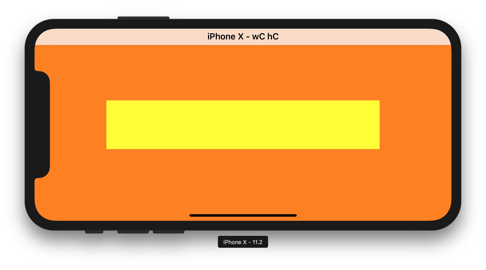

---

### <a name="9"></a>9. `NSLayoutYAxisAnchor`'s `constraintEqualToSystemSpacingBelow(_:multiplier:)` + `NSLayoutYAxisAnchor`'s `constraintEqualToSystemSpacingAfter(_:multiplier:)`
```swift
override func viewDidLoad() {
    let greenView = UIView()
    greenView.backgroundColor = .green
    view.addSubview(greenView)
    greenView.translatesAutoresizingMaskIntoConstraints = false
    greenView.topAnchor.constraintEqualToSystemSpacingBelow(view.topAnchor, multiplier: 1).isActive = true
    greenView.leadingAnchor.constraintEqualToSystemSpacingAfter(view.leadingAnchor, multiplier: 1).isActive = true
    view.trailingAnchor.constraintEqualToSystemSpacingAfter(greenView.trailingAnchor, multiplier: 1).isActive = true
    view.bottomAnchor.constraintEqualToSystemSpacingBelow(greenView.bottomAnchor, multiplier: 1).isActive = true
    
    let magentaView = UIView()
    magentaView.backgroundColor = .magenta
    view.addSubview(magentaView)
    magentaView.translatesAutoresizingMaskIntoConstraints = false
    view.layoutMarginsGuide.topAnchor.constraint(equalTo: magentaView.topAnchor).isActive = true
    view.layoutMarginsGuide.leadingAnchor.constraint(equalTo: magentaView.leadingAnchor).isActive = true
    view.layoutMarginsGuide.trailingAnchor.constraint(equalTo: magentaView.trailingAnchor).isActive = true
    view.layoutMarginsGuide.bottomAnchor.constraint(equalTo: magentaView.bottomAnchor).isActive = true
}
```

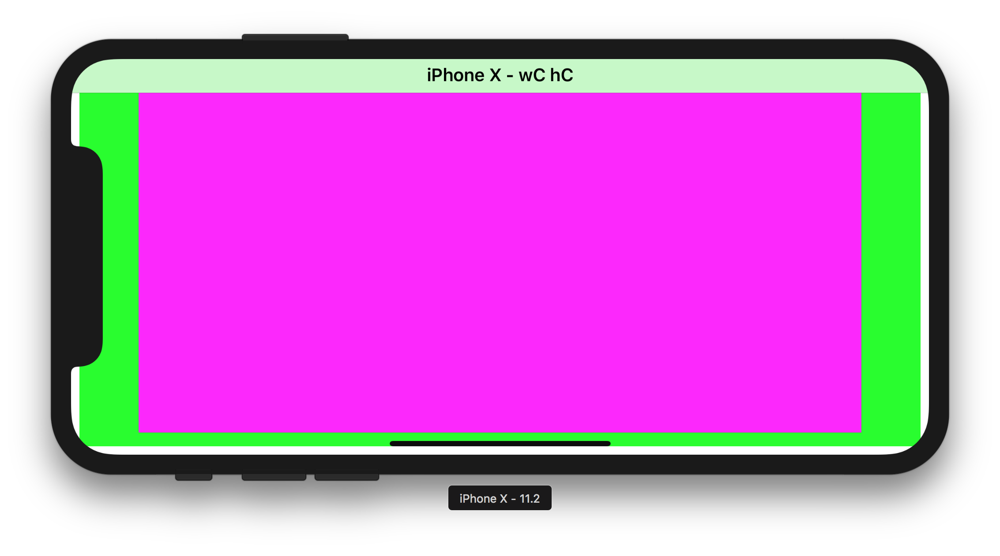

---

### <a name="10"></a>10. `UIStackView`'s `isLayoutMarginsRelativeArrangement`
```swift
override func viewDidLoad() {
    let stackView = UIStackView()
    stackView.isLayoutMarginsRelativeArrangement = true
    stackView.distribution = UIStackViewDistribution.fillEqually
    view.addSubview(stackView)
    stackView.translatesAutoresizingMaskIntoConstraints = false
    stackView.topAnchor.constraint(equalTo: view.topAnchor).isActive = true
    stackView.leadingAnchor.constraint(equalTo: view.leadingAnchor).isActive = true
    stackView.trailingAnchor.constraint(equalTo: view.trailingAnchor).isActive = true
    stackView.bottomAnchor.constraint(equalTo: view.bottomAnchor).isActive = true
    
    let redView = UIView()
    redView.backgroundColor = .red
    stackView.addArrangedSubview(redView)
    
    let blueView = UIView()
    blueView.backgroundColor = .blue
    stackView.addArrangedSubview(blueView)
}
```

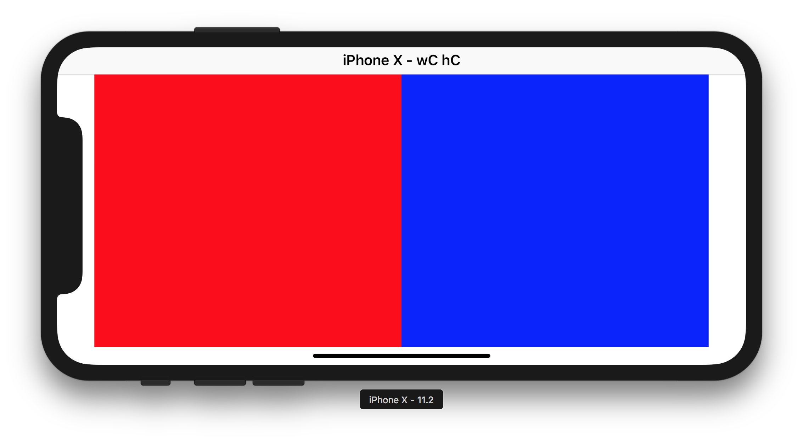

---

### <a name="11"></a>11. `UIScrollView`'s `contentInsetAdjustmentBehavior` + `UIScrollView`'s `contentInset` + `UIScrollView`'s `contentLayoutGuide`
```swift
override func viewDidLoad() {
    let scrollView = UIScrollView()
    scrollView.backgroundColor = .orange
    scrollView.contentInsetAdjustmentBehavior = .scrollableAxes
    scrollView.contentSize.width = 1000
    scrollView.contentInset = UIEdgeInsets(top: 5, left: 5, bottom: 5, right: 5)
    scrollView.contentOffset.x = -5
    view.addSubview(scrollView)
    scrollView.translatesAutoresizingMaskIntoConstraints = false
    scrollView.centerYAnchor.constraint(equalTo: view.centerYAnchor).isActive = true
    view.leadingAnchor.constraint(equalTo: scrollView.leadingAnchor).isActive = true
    view.trailingAnchor.constraint(equalTo: scrollView.trailingAnchor).isActive = true
    scrollView.heightAnchor.constraint(equalToConstant: 80).isActive = true
    
    let blueView = UIView()
    blueView.backgroundColor = .blue
    scrollView.addSubview(blueView)
    blueView.translatesAutoresizingMaskIntoConstraints = false
    blueView.topAnchor.constraint(equalTo: scrollView.contentLayoutGuide.topAnchor).isActive = true
    blueView.leadingAnchor.constraint(equalTo: scrollView.contentLayoutGuide.leadingAnchor).isActive = true
    blueView.widthAnchor.constraint(equalToConstant: 70).isActive = true
    blueView.heightAnchor.constraint(equalToConstant: 70).isActive = true
}
```

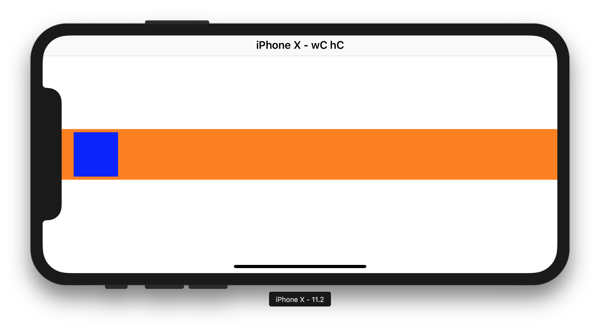

---

### <a name="12"></a>12. `UICollectionView`'s `contentInsetAdjustmentBehavior`
```swift
import UIKit

class CyanCollectionViewCell: UICollectionViewCell {
    override init(frame: CGRect) {
        super.init(frame: frame)
        backgroundColor = .cyan
    }
    
    required init?(coder aDecoder: NSCoder) {
        fatalError("init(coder:) has not been implemented")
    }
}

class ViewController: UICollectionViewController, UICollectionViewDelegateFlowLayout {
    
    let idealCellWidth: CGFloat = 100
    let margin: CGFloat = 5
    
    override func viewDidLoad() {
        collectionView?.contentInsetAdjustmentBehavior = .always
        
        guard let flowLayout = collectionView?.collectionViewLayout as? UICollectionViewFlowLayout else { return }
        flowLayout.minimumInteritemSpacing = margin
        flowLayout.minimumLineSpacing = margin
        flowLayout.sectionInset = UIEdgeInsets(top: margin, left: margin, bottom: margin, right: margin)
        
        collectionView?.register(CyanCollectionViewCell.self, forCellWithReuseIdentifier: "cell")
    }
    
    override func collectionView(_ collectionView: UICollectionView, numberOfItemsInSection section: Int) -> Int {
        return 25
    }
    
    override func collectionView(_ collectionView: UICollectionView, cellForItemAt indexPath: IndexPath) -> UICollectionViewCell {
        return collectionView.dequeueReusableCell(withReuseIdentifier: "cell", for: indexPath) as! CyanCollectionViewCell
    }
    
    func collectionView(_ collectionView: UICollectionView, layout collectionViewLayout: UICollectionViewLayout, sizeForItemAt indexPath: IndexPath) -> CGSize {
        guard let flowLayout = collectionView.collectionViewLayout as? UICollectionViewFlowLayout else { return .zero }
        let availableWidth = collectionView.frame.width - collectionView.safeAreaInsets.left - collectionView.safeAreaInsets.right - flowLayout.sectionInset.left - flowLayout.sectionInset.right
        let idealNumberOfCells = (availableWidth + flowLayout.minimumInteritemSpacing) / (idealCellWidth + flowLayout.minimumInteritemSpacing)
        let numberOfCells = idealNumberOfCells.rounded(.down)
        let cellWidth = (availableWidth + flowLayout.minimumInteritemSpacing) / numberOfCells - flowLayout.minimumInteritemSpacing
        return CGSize(width: cellWidth, height: cellWidth)
    }
    
    override func viewWillTransition(to size: CGSize, with coordinator: UIViewControllerTransitionCoordinator) {
        collectionView?.collectionViewLayout.invalidateLayout()
        super.viewWillTransition(to: size, with: coordinator)
    }
    
}
```

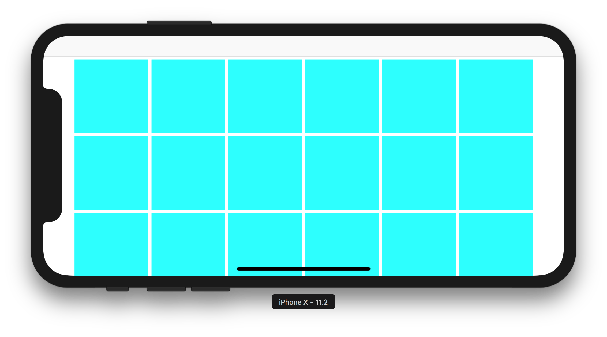

---

### <a name="13"></a>13. `UITableView`'s `insetsContentViewsToSafeArea`
```swift
import UIKit

class Cell: UITableViewCell {

    let label = UILabel()
    
    override init(style: UITableViewCellStyle, reuseIdentifier: String?) {
        super.init(style: style, reuseIdentifier: reuseIdentifier)
        
        contentView.backgroundColor = .yellow
        contentView.addSubview(label)
        
        label.translatesAutoresizingMaskIntoConstraints = false
        label.topAnchor.constraint(equalTo: contentView.layoutMarginsGuide.topAnchor).isActive = true
        label.leadingAnchor.constraint(equalTo: contentView.layoutMarginsGuide.leadingAnchor).isActive = true
        label.trailingAnchor.constraint(equalTo: contentView.layoutMarginsGuide.trailingAnchor).isActive = true
        label.bottomAnchor.constraint(equalTo: contentView.layoutMarginsGuide.bottomAnchor).isActive = true
    }
    
    required init?(coder aDecoder: NSCoder) {
        fatalError("init(coder:) has not been implemented")
    }
    
}

class ViewController: UITableViewController {

    override func viewDidLoad() {
        tableView.register(Cell.self, forCellReuseIdentifier: "cell")
        tableView.insetsContentViewsToSafeArea = true
    }
    
    override func tableView(_ tableView: UITableView, numberOfRowsInSection section: Int) -> Int {
        return 10
    }
    
    override func tableView(_ tableView: UITableView, cellForRowAt indexPath: IndexPath) -> UITableViewCell {
        let cell = tableView.dequeueReusableCell(withIdentifier: "cell", for: indexPath) as! Cell
        cell.label.text = "Lorem ipsum"
        return cell
    }
}
```

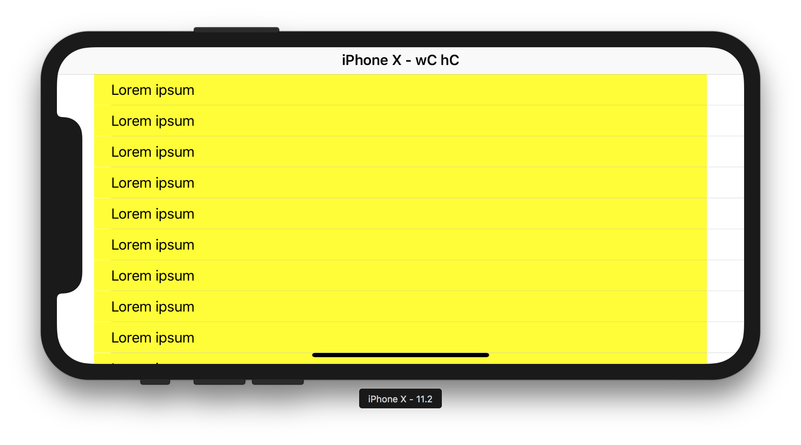
